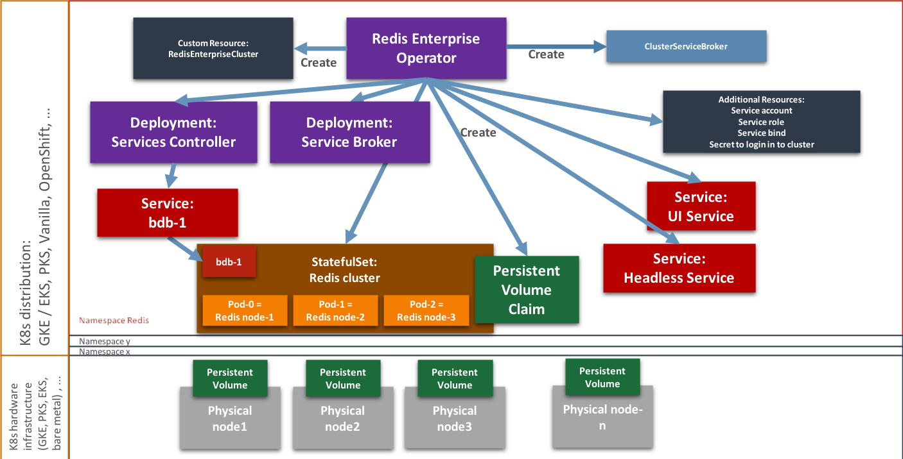
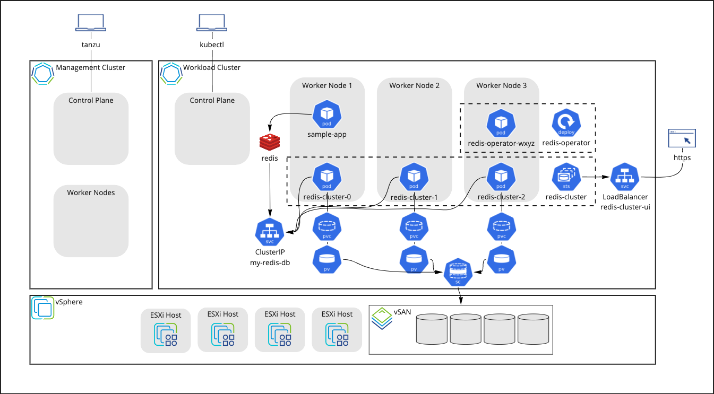
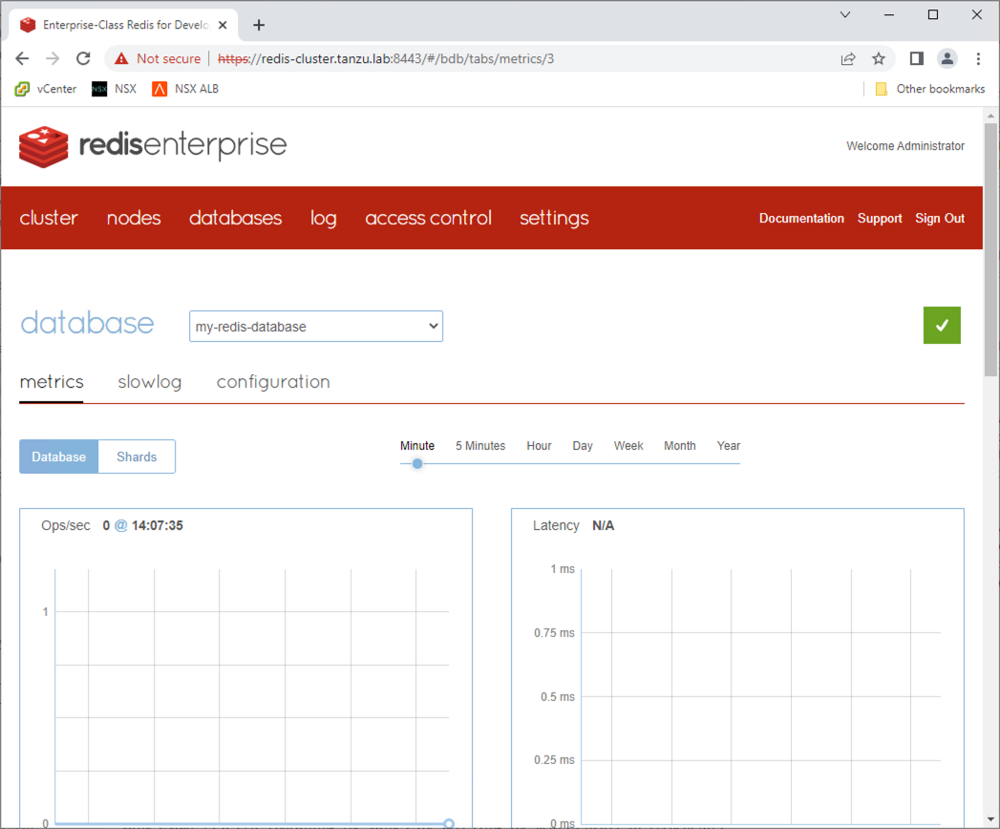
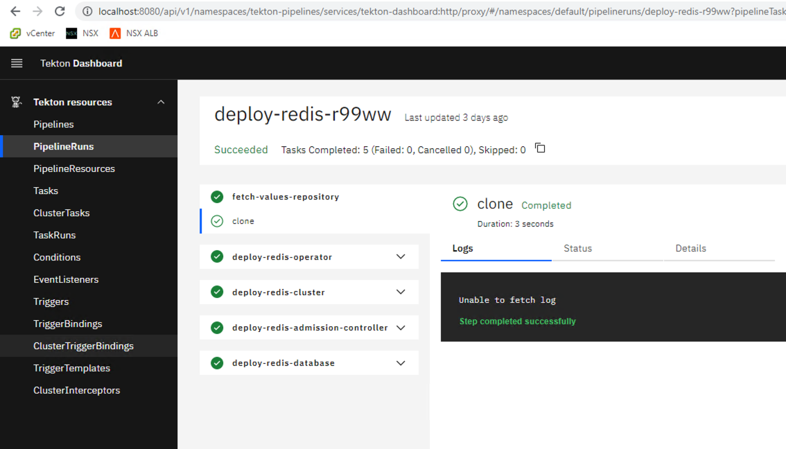

# Redis Enterprise on Tanzu Reference Architecture

By: Pete Wall, Staff Solutions Architect

Last Updated: May 11th, 2022

## Architecture Overview

This document details a reference architecture for deploying Redis Enterprise on Tanzu Kubernetes Grid (TKG). This reference will cover topics such as Kubernetes requirements and cluster layout for Redis Enterprise.

This architecture should give you a path to creating a production-grade deployment of Redis Enterprise. However you should not feel constrained by this exact path if your specific use cases lead you to a different deployment architecture. Design decisions in this architecture reflect the main design issues and the rationale behind a chosen solution path and if necessary can help provide rationale for any deviation.

### Cluster layout

The level of availability and redundancy required by the workloads being deployed will determine the topology of the clusters, from a simpler, single cluster running in just one availability zone, to a more complex deployment of multiple clusters distributed all over the world, either on a single cloud provider, or across multiple cloud providers.

## Bill of Materials

| Component             | Version  |
|-----------------------|----------|
| Tanzu Kubernetes Grid | 1.5.1    |
| Kubernetes            | 1.22.5   |
| Redis Enterprise      | 6.2.10-4 |

This reference architecture was validated using these versions of Tanzu and Redis Enterprise solutions.

## Design Use-Cases

| Design # | Decision | Rationalization | Ramifications |
| TKG-001  | A single cluster in one region and one availability zone. | Appropriate choice for a development/test, non-critical environment where availability, or loss of data is of little to no concern. Primary benefit of this design is ease of deployment. | Not an option for workloads requiring high availability, durability, and resiliency.|

### Redis Enterprise Components

The following components are installed and run on one or more Kubernetes clusters.
* **Redis Operator**, the fastest, most efficient way to deploy and maintain a Redis Enterprise cluster in Kubernetes. It follows the standardized operator framework, and deploys a Redis Enterprise Cluster using CustomResourceDefinitions.
* **Redis Enterprise Cluster** hosts the Redis Enterprise Databases and manages the distribution of data processing and storage across multiple Kubernetes nodes.
* **Redis Enterprise Database Admission Controller**, dynamically validates the Redis Enterprise Database configuration.
* **Redis Enterprise Database**, provides the Redis interface to be used by the workloads on the cluster.


_Architecture diagram of the Redis Operator._

https://docs.redis.com/latest/kubernetes/architecture/operator/

## Architecture

### Cluster Requirements

The requirements for deploying Redis Enterprise differ if it is being deployed into a development or a production environment. A development environment can be useful for functional testing against a live database. A production environment is used in production as well as testing in production-like scenarios, such as performance and failover testing. Below is a table of recommended cluster sizing for both scenarios:

#### Development Environments

|                     | Minimum | Recommended |
|---------------------|---------|-------------|
| Control plane nodes | 1       | 1           |
| Worker nodes        | 1       | 3           |
| CPU cores/node      | 4 cores | 8 cores     |
| Memory/node         | 4GB     | 8GB         |
| Storage/node        | 20GB    | 40GB        |

#### Production Environments

|                     | Minimum | Recommended |
|---------------------|---------|-------------|
| Control plane nodes | 3       | 3+          |
| Worker nodes        | 3       | 3+*         |
| CPU cores/node      | 4 cores | 8 cores**   |
| Memory/node         | 4GB     | 8GB***      |
| Storage/node        | 20GB    | 40GB        |
| Ephemeral storage/node<br>(replication and log files) | Node memory x2 | Node memory x4+ |
| Persistent storage/node<br>(snapshots and aof files) | Node memory x3 | Node memory x6 |

\* The number of worker nodes should be odd.

** CPU Core considerations:
* There should be at least one available core per shard of the database.
* If one cluster node is utilizing >80% CPU, consider migrating resources to less active nodes to balance usage.
* If all cluster nodes are utilizing >80% CPU, consider adding another worker node.

*** Memory considerations:
* There should be at least 30% memory free on each node
* If a node is utilizing >65% memory, consider migrating resources to less active nodes to balance usage.
* If all cluster nodes are utilizing >70% memory, consider adding another worker node.

For more details, please refer to the [Redis Enterprise documentation](https://docs.redis.com/latest/rs/administering/designing-production/hardware-requirements/).

### Architectural View



_Architecture diagram of Redis Enterprise on VMware Tanzu Kubernetes Grid on vSphere_

### Backup and Recovery

Redis Enterprise databases have multiple methods for backup and recovery.

#### HA and Persistence

From a performance perspective, it is always preferred to failover from a primary database shard to an in-memory synchronized secondary database shard, and this is how Redis Enterprise works; only when the primary and secondary shards are lost is the database restored from disk. Similarly, in the case of a datacenter failure, failing over to a synchronized active-active database in another data center will be faster than recovering from disk.

To this end, enable replication to add a seconary shard for every primary shard and enable persistence in the Redis Enterprise database which will allow the storage layer to manage the data. If both the primary and secondary shards are lost, they will recover from the existing PersistentVolume. If the majority of primary and secondary shards are lost, the database needs to be re-created from the existing PersistentVolume. If the majority of Redis Enterprise node-pods are lost, the cluster can be reconnected to the existing PersistentVolume and then the data can be recovered by following [these steps](https://docs.redis.com/latest/kubernetes/re-clusters/cluster-recovery/).

#### Redis Backups

Second, the Redis Enterprise Database spec allows for scheduling of periodic backups to various filestores:

* Filesystem mount path (e.g. made available to the cluster via Kubernetes volumes)
* FTP servers
* SFTP Servers
* Amazon Simple Storage Service (S3)
* Azure Blob Storage
* Google Cloud Storage

If the database needs to be re-created, the new database can load the backup data by following [these steps](https://docs.redis.com/latest/rs/databases/import-export/import-data/).

### Monitoring

The following are options for monitoring real-time universe metrics and statistics.


_The Redis Enterprise Cluster management UI_

* **Redis Enterprise Cluster UI**, a browser-based user interface that shows the status of each Redis Enterprise Database that is deployed within this cluster. It is deployed within the Kubernetes cluster and can be exposed via Kubernetes services.

* **Tanzu Observability**, a SaaS-based tool for collecting metrics, traces, and logs. Includes 200+ integrations with the most popular services and libraries, including Redis.

### Logging

Event logs can be accessed via the Redis Enterprise Cluster UI.

Pod logs can be retrieved by deploying and configuring a logging sidecar, such as fluentd.

# Deployment

## Versions Used
| Component                                                 | Versions  |
|-----------------------------------------------------------|-----------|
| Tanzu Kubernetes Grid                                     | 1.5.1     |
| Kubernetes                                                | 1.22.5    |
| [jq](https://stedolan.github.io/jq/manual/v1.6/)          | 1.6       |
| [kapp](https://carvel.dev/kapp/)                          | 0.42.0    |
| [vendir](https://carvel.dev/vendir/)                      | 0.23.0    |
| [ytt](https://carvel.dev/ytt/)                            | 0.35.1    |
| Redis Enterprise Operator                                 | 6.2.10-4  |
| Redis Enterprise Cluster                                  | 6.2.10-90 |
| Redis Enterprise Cluster (Services Rigger & Bootstrapper) | 6.2.10-4  |

Instructions and installation scripts can be downloaded from the following repository: https://via.vmw.com/RedisOnTanzuSource

Generic documentation for deploying Redis Enterprise on any Kubernetes can be found here: https://github.com/RedisLabs/redis-enterprise-k8s-docs

## Overview

The installation process basically consists of four stages (assuming pre-existing Kubernetes cluster):

1. **Deploy the Redis Enterprise Operator**, which utilizes the [operator pattern](https://kubernetes.io/docs/concepts/extend-kubernetes/operator/) to enable construction of complex structures all by deploying simple custom resources. The operator itself is a deployment that runs in the Kubernetes cluster, watches for RedisEnterpriseCluster and RedisEnterpriseDatabase objects, and when those resources are created, takes the appropriate actions to deploy a functional cluster and database.
1. **Deploy the Redis Admission Controller**, works with the operator and cluster to validate the RedisEnterpriseDatabase objects when they are being created.
1. **Deploy the Redis Enterprise Cluster**, which allocates the space in the Kubernetes cluster for databases to utilize.
1. **Deploy a Redis Database**, which instantiates the database that can be used by workloads on the Kubernetes cluster.

## Getting Started

From an operator’s machine, clone the following repository: https://via.vmw.com/RedisOnTanzuSource

Launch a terminal and run the following command:

```bash
$ vendir sync
```

The repository contains references to other dependent repositories. [Vendir](https://carvel.dev/vendir/) is used to pull those repositories, tagged to a specific revision.

## Prepare Values File

The deployment process and scripts in this repository commonly use a values file. This file is used for replacing generic values in the various deployment files. Keeping the values in one file ensures deployment consistency and facilitates automation. Here is a sample values.yaml and explanation of the values:

```yaml
---
imageRegistry:imageRegistry: harbor-repo.vmware.com/dockerhub-proxy-cache/
namespace: redis
cluster:
 name: redis-cluster
 nodes: 3
 adminUsername: pwall@vmware.com
database:
 name: my-redis-database
 memorySize: 100MB
 modules:
 - name: search
   version: 2.2.6
 - name: timeseries
   version: 1.4.13
license: |
 ----- LICENSE START -----
 Snipped
 ----- LICENSE END -----
```

## Deploying the Redis Enterprise Operator

To deploy the Redis Enterprise Operator, we deploy a namespace and several objects as specified in [the documentation](https://github.com/RedisLabs/redis-enterprise-k8s-docs#installation). Alternatively, we can use the deployment script, which gets the namespace from the values file:

```bash
$ export NAMESPACE=redis
$ kapp deploy --app redis-operator \
    --into-ns "${NAMESPACE}" \
    --diff-changes \
    --file <(ytt -f deployment/namespace.yaml -f "${NAMESPACE}") \
    --file vendor/redis/role.yaml \
    --file vendor/redis/role_binding.yaml \
    --file vendor/redis/service_account.yaml \
    --file vendor/redis/crds/rec_crd.yaml \
    --file vendor/redis/crds/redb_crd.yaml \
    --file vendor/redis/admission-service.yaml \
    -–file vendor/redis/operator.yaml

OR

$ ./scripts/deploy-redis-operator.sh /path/to/values.yaml
```

Note: The same Kubernetes namespace for deploying the operator, the cluster, and the databases should be used. There [are ways](https://github.com/RedisLabs/redis-enterprise-k8s-docs/tree/master/multi-namespace-redb) to use one operator to manage multiple databases in different namespaces, but that is not covered in this document.

## Deploying the Redis Enterprise Admission Controller

Deploying the admission controller will allow the operator to work with the Redis Enterprise Cluster to validate Redis Enterprise Database deployments. We use a ytt overlay to set the namespace and certificate values in the webhook resource before deployment. Alternatively, we can use the deployment script, which gets the namespace from the values file:

```bash
$ cert=$(kubectl get secret admission-tls -n "${NAMESPACE}" -o jsonpath='{.data.cert}')
$ kapp deploy --app redis-admission-controller \
    --into-ns "${NAMESPACE}" \
    --diff-changes \
    --file <(ytt \
        –file vendor/redis/admission/webhook.yaml \
        --data-value cert="${cert}" \
        --data-value namespace="${NAMESPACE}" \
        --file overlays/update-admission-controller.yaml)

OR

$ ./scripts/deploy-redis-admission-controller.sh /path/to/values.yaml
```

## Deploying the Redis Enterprise Cluster

Deploying the cluster works by creating an instance of a RedisEnterpriseCluster custom resource. The operator then creates the stateful set that allocates space for databases in the Kubernetes cluster. After deployment, the state of the RedisEnterpriseCluster object should be monitored for the Status to become “Running”. Alternatively, the deployment script can be used, which gets the cluster name and the namespace from the values file, and will wait for the cluster to be ready:

```bash
$ export clusterName=redis-cluster
$ export clusterNodes=3
$ export license=<Redis Enterprise License key>
$ kapp deploy --app "${clusterName}" \
    --into-ns "${NAMESPACE}" \
    --diff-changes \
    --file <(ytt \
        --file deployment/cluster.yaml \
        --data-value cluster.name="${clusterName}" \
        –-data-value cluster.nodes="${clusterNodes}" \
        --data-value license="${license}")

OR

$ ./scripts/deploy-redis-cluster.sh /path/to/values.yaml
```

## Deploying the Redis Enterprise Database

Deploying the database works by creating an instance of a RedisEnterpriseDatabase custom resource. The operator will create the database within the Redis Enterprise Cluster pods. Alternatively, we can use the deployment script, which gets the necessary information from the values file:

```bash
$ export databaseName=my-redis-database
$ export memorySize=100MB
$ export persistence=aofEverySecond
$ kapp deploy --app "${databaseName}" \
    --into-ns "${NAMESPACE}" \
    --diff-changes \
    --file <(ytt \
        --file deployment/database.yaml
        --data-value cluster.name="${clusterName}" \
        --data-value database.name="${databaseName}" \
        --data-value database.memorySize="${memorySize}" \
        --data-value database.persistence="${persistence}")

OR

$ ./scripts/deploy-redis-database.sh /path/to/values.yaml
```

## Deploying via Tekton Pipeline


_Redis Enterprise deployed with a Tekton pipeline_

As an alternative to the imperative deployment of Redis Enterprise resources described above, all can be deployed with automation using a Tekton pipeline. This simplifies the deployment process, but can be augmented to allow for dev-ops style deployment of Redis Enterprise Databases.

### Tekton Pipeline Prerequisites

* A Kubernetes cluster where Tekton will be deployed
* A Kubernetes config file with its current context configured to point to the cluster where Redis will be deployed
* A git repository with values.yaml committed
* An private SSL key with access to the values repository

### Deploying the Pipeline

To deploy the pipeline, target the Kubernetes cluster that will host Tekton and run the following commands:

```bash
$ ./scripts/deploy-cluster-secret.sh /path/to/redis-cluster-kubeconfig.yaml
$ ./scripts/deploy-repository-secret.sh /path/to/values-repository/id_rsa
$ ./scripts/deploy-pipeline.sh
```

This will deploy Tekton, the Tekton Dashboard, and the pipeline and tasks that can deploy Redis Enterprise. The dashboard can be accessed by running:

```bash
$ kubectl proxy --port=8080
```

And then opening this URL in a web browser: http://localhost:8080/api/v1/namespaces/tekton-pipelines/services/tekton-dashboard:http/proxy/#/about

### Running the Pipeline

To trigger the pipeline, a PipelineRun object needs to be created. An example PipelineRun object has been made at pipeline-run.yaml. The URL for the values file repository (i.e. defined at spec.params[0].value) will need to be replaced.

```bash
$ kubectl create -f pipeline-run.yaml
```

## Connecting to Tanzu Observability

If the Kubernetes cluster is connected to Tanzu Observability, the Redis Enterprise Databases can be connected to the built-in Wavefront Collector. Deploying a specially crafted Kubernetes secret will invoke Tanzu Observability’s rule-based auto-discovery and enable the Redis telegraf agent to pull metrics from the database. This script can be used to create the secret given the namespace and Redis Enterprise Database name:

```bash
$ ./scripts/deploy-tanzu-observability-collector.sh $NAMESPACE <redb name>
```

## Troubleshooting

### Docker Hub rate limiting

By default, the container images are stored in Docker Hub. Even though these images are public, often unauthenticated pulls of these images will be blocked due to rate limiting. There are two options for mitigating this:

1. Add a registry credential secret for Docker Hub and modify the deployment objects to use that secret.
1. Get the images from a separate container image registry. This can be done either with a private registry after the images have been copied over, or with a Docker Hub proxy.

This document shows the second approach, as the only change to the deployment objects is the image name. ytt overlay files have been provided to modify the image path for both the Redis Enterprise Operator and the Redis Enterprise Cluster.

#### Redis Enterprise Operator

When deploying the operator, instead of deploying operator.yaml unmodified, use this line instead:

```bash
ytt --file vendor/redis/operator.yaml \
    --file overlays/set-operator-image-registry.yaml \
    --data-value imageRegistry="harbor.example.com/dockerhub-proxy-cache"
```

This will prepend the image registry (“harbor.example.com/dockerhub-proxy-cache” in this case) to the existing images. For example, instead of the default of “redislabs/operator:6.2.10-4”, the image will be “harbor.example.com/dockerhub-proxy-cache/redislabs/operator:6.2.10-4”

#### Redis Enterprise Cluster

When deploying the cluster, the images can be specified. One option would be to deploy alternative image paths in the cluster object. Another option is to utilize a ytt overlay, similar to the one used for operator objects above. When deploying the cluster, in the ytt command for cluster.yaml, add these lines:

```bash
--file overlays/set-cluster-image-registry.yaml \
--data-value imageRegistry="harbor.example.com/dockerhub-proxy-cache"
```

### http2: client connection lost when deploying RedisEnterpriseCluster CRD

Deploying the RedisEnterpriseCluster CRD occasionally can fail. This is likely caused by the size of that CRD and slow network connection between the Kubernetes cluster and the kapp/kubctl client.

```
kapp: Error: Applying create customresourcedefinition/redisenterpriseclusters.app.redislabs.com (apiextensions.k8s.io/v1) cluster:
  Creating resource customresourcedefinition/redisenterpriseclusters.app.redislabs.com (apiextensions.k8s.io/v1) cluster:
    API server says:
      Post "https://192.168.20.101:6443/apis/apiextensions.k8s.io/v1/customresourcedefinitions": http2: client connection lost (reason: )
```

To mitigate this issue, re-run the command. Optionally, pre-creating the Redis Enterprise Cluster CRD with kubectl might help

```bash
$ kubectl apply -n $NAMESPACE -f vendor/redis/crds/rec_crd.yaml
```
